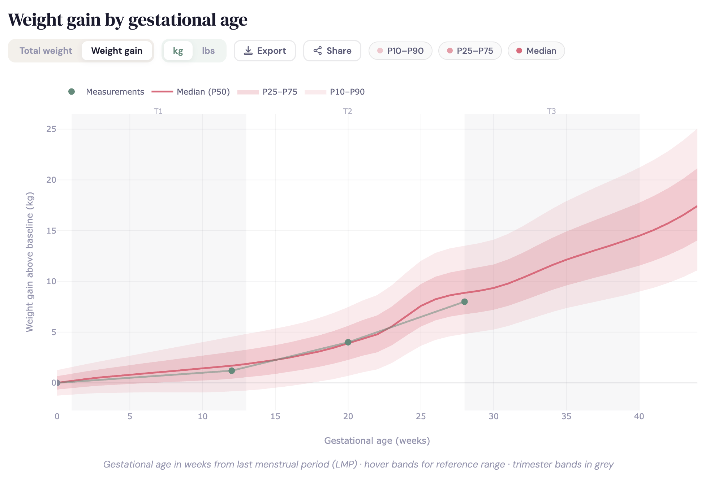

# Gestational Weight Journey

An interactive, personalised gestational weight reference chart — built as a single self-contained HTML file with no backend or build step required.



## What it does

Enter your height and pre-pregnancy weight to instantly see your personalised weight reference curves, based on data from 218,216 pregnancies across 33 international cohorts. Log past and current weigh-ins to track your trajectory against the reference bands.

## Features

- **Personalised curves** — reference bands adjust to your pre-pregnancy BMI group (six groups: underweight through obesity grade 3)
- **Total weight or weight gain mode** — toggle between absolute weight and kg/lbs gained above baseline
- **kg / lbs toggle** — switch units at any time; all values convert automatically
- **Due date calculator** — enter your due date to auto-fill your current gestational week
- **Past weigh-ins** — log multiple measurements to see your full trajectory
- **Hover tooltips** — hover the reference bands for the expected gain range at any week; hover your data points for gain and percentile
- **Trimester markers** — T1/T2/T3 bands for clinical landmarks
- **Snapshot card** — instant read-out of kg gained and percentile with a plain-language label
- **Shareable URL** — encodes your full state into a link you can bookmark or share
- **Persistent state** — all inputs are saved to localStorage and restored on next visit
- **Export PNG** — saves a 2× resolution chart image with a white background
- **Dark mode** — respects your system colour scheme preference
- **Print-friendly** — browser print (Ctrl/Cmd+P) renders a clean chart-only layout
- **Mobile-friendly** — responsive layout, sliders hidden on touch devices

## Data source

Based on:

> Santos S, Eekhout I, Voerman E, et al. **Gestational weight gain charts for different body mass index groups for women in Europe, North America, and Oceania.** *BMC Medicine.* 2018;16:201. [doi:10.1186/s12916-018-1189-1](https://doi.org/10.1186/s12916-018-1189-1)

Week-specific centile tables (P1–P99) for six pre-pregnancy BMI groups are embedded directly in the HTML file — no external data requests are made.

## Limitations

- The reference population is predominantly European, North American, and Oceanian. Curves may be less representative for women from other ethnic backgrounds.
- Data is for **singleton pregnancies only**. Twin and multiple pregnancies have different weight gain patterns.
- All data is self-reported by the user; the tool performs no clinical validation.
- This tool is for **informational purposes only** and does not constitute medical advice. Always discuss weight and nutrition with your healthcare provider.

## Deployment

The tool is a single file with no dependencies to install. Everything — data, styles, and logic — is embedded in `index.html`.

### GitHub Pages (recommended)

1. Fork or clone this repository
2. Go to **Settings → Pages → Source**, select the `main` branch and `/ (root)`
3. Click **Save** — your site will be live at `https://yourusername.github.io/repo-name/` within a minute

### Local use

Just open `index.html` in any modern browser. No server needed.

## File structure

```
index.html      # The entire application — self-contained, no build step
README.md
```

## Credits

Original implementation by [Nadiya Shvai](https://nshvai.github.io/).  
Redesign and feature development assisted by [Claude](https://claude.ai) (Anthropic).
